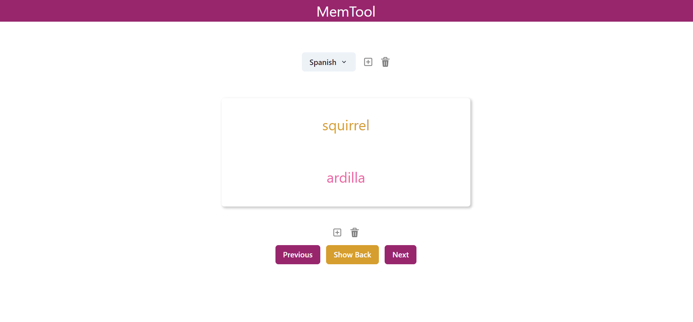
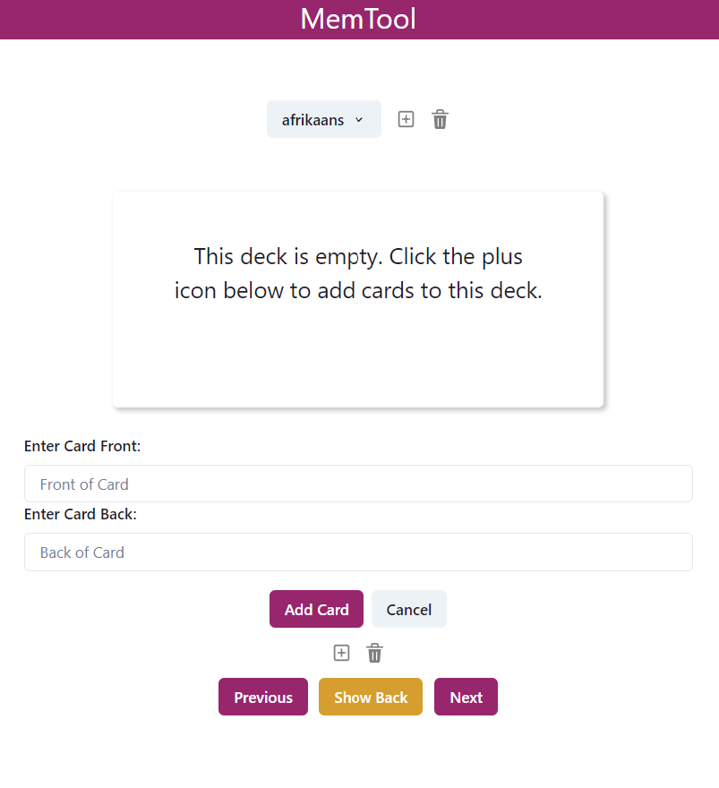
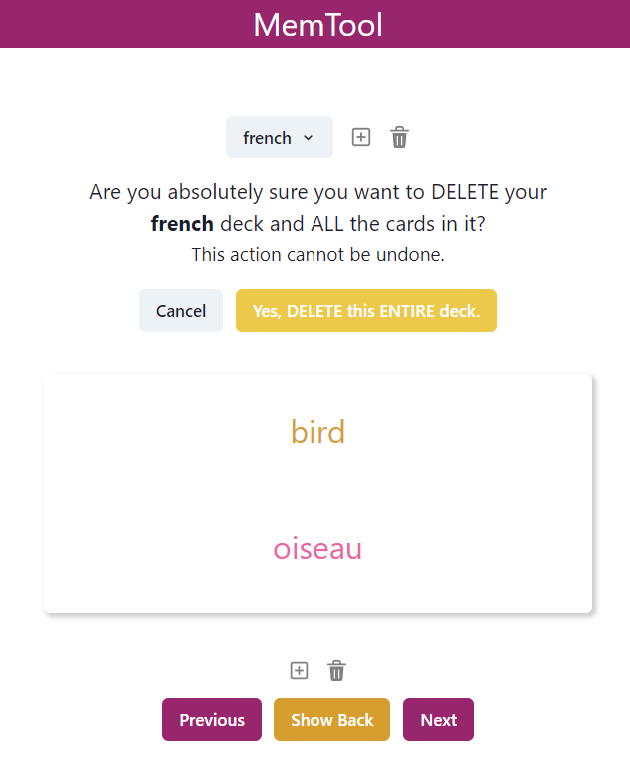
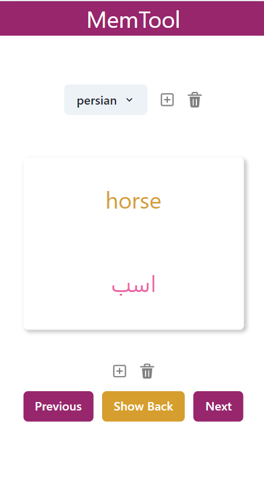

# MemTool

This app allows you to create and delete flashcards and decks.
---
---

### Review Cards in Each Deck 🔎
  

### Add a Card to a Deck ➡️
  

### Delete a Deck ❌
  

### Works Well on Mobile 📱
  
